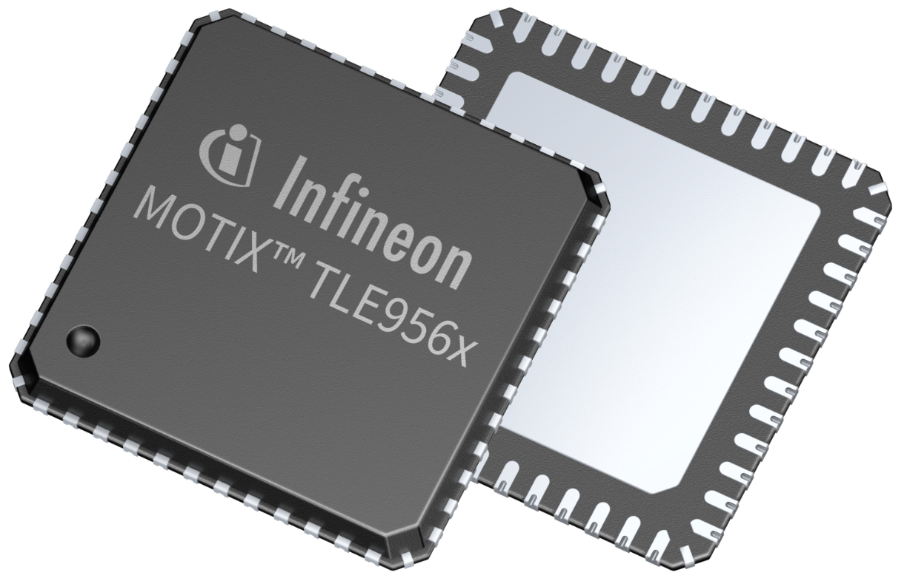
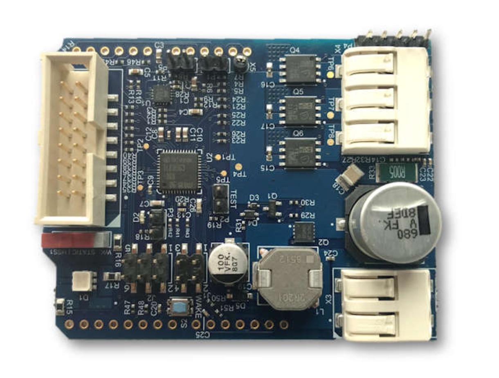
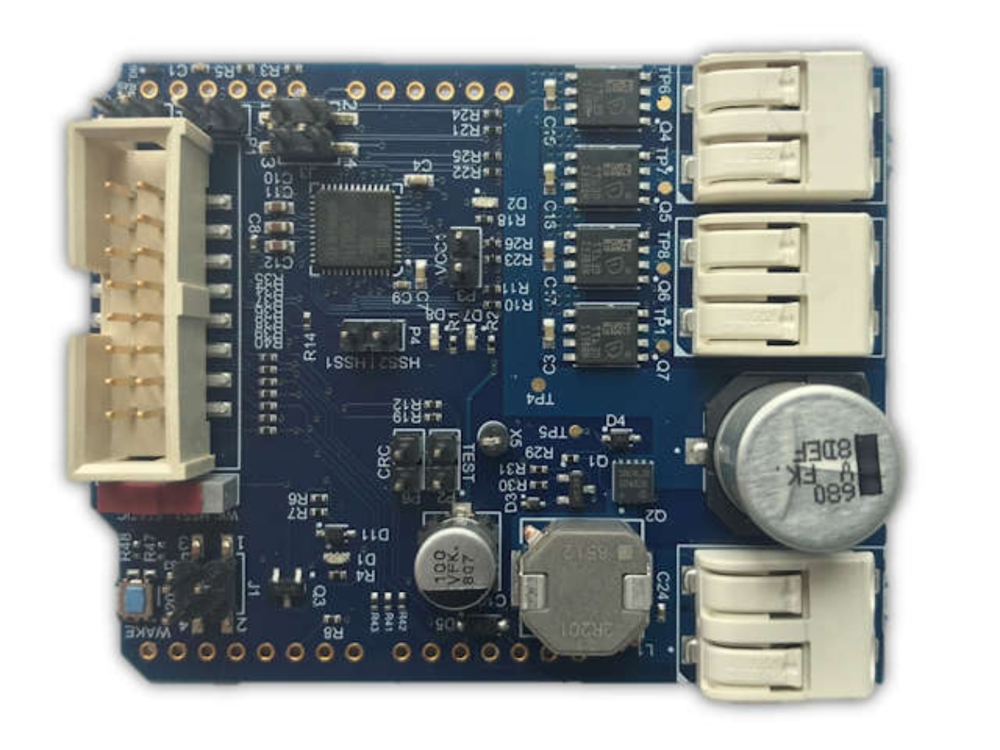

**************
Introduction
**************
Welcome to the Infineon Motor System IC TLE956x library docs!

Scope
=====
This library covers the following products:

BLDC Motor Shield with TLE9563
-------------------------------

* `BLDC SHIELD TLE9563-3QX`_
* `TLE9563-3QX`_

DC Motor Shield with TLE9562
----------------------------

* `DC SHIELD TLE9562-3QX`_
* `TLE9562-3QX`_

.. _`BLDC SHIELD TLE9563-3QX`: https://www.infineon.com/cms/en/product/evaluation-boards/bldc-shield_tle956x/
.. _`DC SHIELD TLE9562-3QX`: https://www.infineon.com/cms/en/product/evaluation-boards/dc-shield_tle956x/
.. _`TLE9563-3QX`: https://www.infineon.com/cms/en/product/power/motor-control-ics/bldc-motor-driver-ics/bldc-motor-system-ics/tle9563-3qx/
.. _`TLE9562-3QX`: https://www.infineon.com/cms/en/product/power/motor-control-ics/brushed-dc-motor-driver-ics/dc-motor-system-ics/tle9562-3qx/

License
=======

Please find the license file for this library `here <https://github.com/Infineon/high-side-switch/blob/master/LICENSE>`_.

.. toctree::
   :maxdepth: 3
   :caption: Wiki Sections
   :hidden:

   Introduction <self>
   Hardware Platforms <hardware-platforms.rst>
   Related Links <links.rst>

.. toctree::
   :maxdepth: 4
   :caption: Library Details
   :hidden:

   API <lib-details/api.rst>
   PAL Interface <lib-details/pal-interface.rst>
   Doxygen Docs <lib-details/doxygen.rst>
   Acronyms <lib-details/acronyms.rst>

.. toctree::
   :maxdepth: 3
   :caption: Hardware Platforms
   :hidden:

.. toctree::
   :maxdepth: 3
   :caption: Software Frameworks
   :hidden:

   sw-frmwk/arduino/index