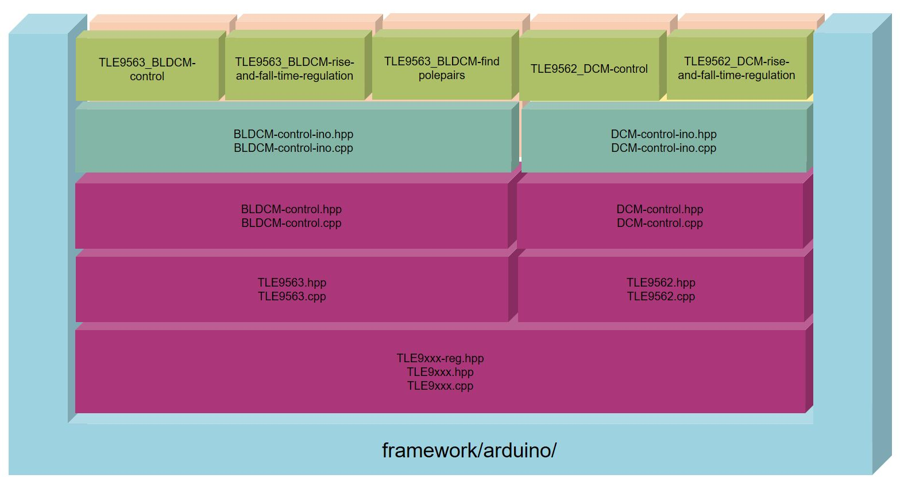

Library Architecture
--------------------

The TLE956x Motor System IC library follows the architecture pattern shown in the stack diagram:

.. image:: ../img/ifx-gen-arch.png
    :height: 400

The monolithic core library can be universally integrated across any low level peripheral drivers, embedded operating system, and middleware of each software framework.

The reusability and interoperability is achieved by defining a Platform Abstraction Layer (PAL) interface which is implemented by each framework for its specific hardware abstraction layer and operating system resources APIs.

Additionally, the core library API is accommodated and adapted to the particularities of each software framework. The framework API wrappers intend to harmonize the core library API with that of the software development framework in which it is integrated, making it easier for the users already familiarized with the development framework.

The support for the multiple hardware platforms is then provided by each development framework.

The specific TLE956x Motor System IC library modules are depicted more specifically below:

In the next sections, the information of the main architecture modules for the TLE956x Motor System IC library is extended.

Core Library
""""""""""""

The core library contains all the library logic and high level functionalities of the gTLE956x Motor System IC peripheral . The core library remains C++ agnostic by interacting with the specific platform (and framework) through a Platform Abstraction Layer interface. Almost no other dependencies than standard C/C++ modules and the PAL are found in these sources, only the Serial.print() is an Arduino specific command that is still needed for error communication.

There is one base class that is necessary for all applications with this chip:

.. doxygenclass:: Tle9xxx
	:outline:

There are two derived classes, that represent a specific version of the chip.

.. doxygenclass:: Tle9562
	:outline:
.. doxygenclass:: Tle9563
	:outline:

Furthermore there are classes for each board available, that use instances of the TLE9562 / TLE9563 classes.

.. doxygenclass:: DCMcontrol
	:outline:
.. doxygenclass:: BLDCMcontrol
	:outline:

These classes are then derived to be specific for Arduino UNO. Here nothing but the pin definition will happen:

.. doxygenclass:: DCMcontrolIno
	:outline:
.. doxygenclass:: BLDCMcontrolIno
	:outline:

These code sources can be found under "src/corelib".

Platform Abstraction Layer (PAL) Interface
""""""""""""""""""""""""""""""""""""""""""

The Platform Abstraction Layer Interface is implemented via abstract C++ classes declaring all the necessary platform resources and functionalities that need to be provided by the specific framework-platform implementation.

The simple BLDCMcontrol specifies in its PAL modules an ADC class, a GPIO class, and a Timer class. Its implementation is located in the "src/pal" folder.

Framework PAL
"""""""""""""

The PAL interfaces is defined for each embedded software framework through its low level peripheral drivers and operating system resources APIs. The ADC, GPIO and Timer interface abstract classes are inherited and defined in this layer.

The "src/framework/sample_fmwk/pal" folder contains the pal implementation for the particular framework.

Find more information about the supported software development frameworks in the Software Frameworks section.

Framework API Wrapper
"""""""""""""""""""""

The idea behind this layer is to adapt the library in order to comply with the programming conventions of the integrated programming framework or ecosystem.

Operating system libraries, low level driver of hardware peripherals (digital input/outputs, PWM, analog conversion, etc.) or other middleware resources are implemented for each development framework following certain patterns for functions, parameters, and primitive types.

At these level, certain platform functionalities can be already defined and adapted to the API available resources: functions prototypes, framework core libraries, low level driver HAL, programming patterns, and even framework feel and look aspects.

The frameworks wrapper API files and pin configuration are located in the "src/framework/sample_fmwk/wrapper" folders.

Find more information about each software development frameworks API in the Software Frameworks section.

Predefined Hardware Platforms
"""""""""""""""""""""""""""""

Given a particular hardware platform and development software framework, most of the resources and its configuration can be already determined by default. This part of the framework API just define some pre configured instances for common and officially supported evaluation kits based configuration.

These instances are available in the "src/framework/sample_fmwk/wrapper/zzz-platf-xxx.hpp/cpp" source files.

