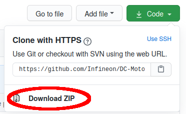

.. _arduino-lib-installation:

Arduino Library Installation
============================
Required Software
-----------------

1. **Install the Arduino IDE**. If you are new to Arduino, please `download <https://www.arduino.cc/en/Main/Software>`__ the program and install it first.

2. **Include the XMC boards in the IDE (if a XMC is used)**. The official Arduino boards are already available in the Arduino IDE, but other third party boards as the Infineon XMC MCU based ones need to be explicitly included. Follow the instructions in the `link <https://github.com/Infineon/XMC-for-Arduino#installation-instructions>`__ to add the XMC board family to the Arduino IDE.

3. **Install the library**. In the Arduino IDE, go to the menu *Sketch > Include library > Library Manager*. Type **motor system IC TLE956x** and install the library.

Installation Methods
--------------------

The library can be installed in several ways:

* Arduino IDE library manager
* Arduino IDE import .zip library
* Arduino IDE manual installation

These installation processes are conveniently described on the official `Arduino`_ website.

.. _Arduino: https://www.arduino.cc/en/guide/libraries

* **Arduino IDE Library Manager**

Library name: ``motor system IC TLE956x``

* **Arduino IDE Manual Installation**

Download the desired .zip library version from the repository `releases`_ section. 

.. _releases: https://github.com/Infineon/motor-system-ic-tle956x/releases

.. warning::
    As a general recommendation, downloading directly from the master branch should be avoided. 
    Even though it should not, it could contain incomplete or faulty code.

